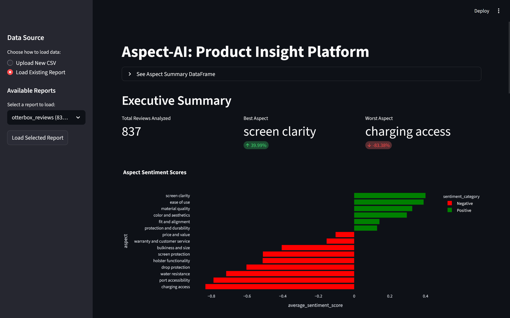
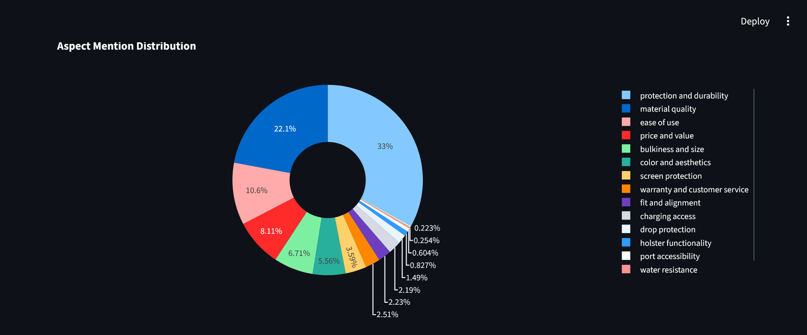
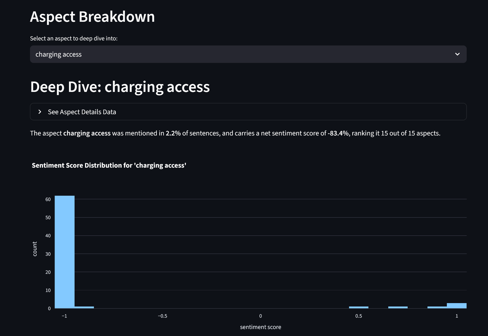
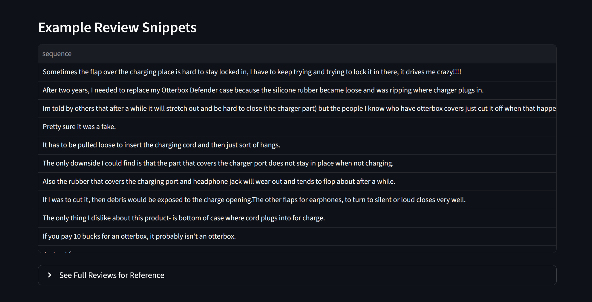

# Aspect-AI: Product Insight Platform 

## Turn thousands of customer reviews into actionable insights.

### What It Is
Aspect-AI is an analytics tool that takes raw product reviews (from a CSV) and generates a comprehensive interactive dashboard. It uses a thoughtful AI pipeline to discover "aspects" customers are talking about, and aggregates the sentiment towards them.

The app allows you to easily pinpoint a products strengths and weaknesses. This is highly useful for both businesses and consumers, and is excellent for influencing future design or puchasing decisions.

## Core Features
* 📄 Upload any CSV of customer reviews to generate a report.
* 💾 All reports are saved to a local SQL database. Load saved reports instantly to save time and resources.
* 🤖 AI Pipeline: Uses a local LLM (via Ollama) for dynamic aspect discovery and Hugging Face transformers for sentence classification and sentiment analysis.
* 📊 Interactive Streamlit UI with Plotly charts.
* 🔬 Deep-Dive Analysis: Select any aspect to see its sentiment distribution and the raw review snippets that mention it.

## Tech Stack

* UI: Streamlit
* AI: Hugging Face transformers, Ollama (Gemma3)
* Data manipulation: Pandas
* Visualtisations: Plotly
* Database: SQLite
* NLP: NLTK

## Screenshots






## How to Run (Local Setup)

### 1. Prerequisites

You must have Ollama installed and running locally.

Pull the required Gemma models:
```
ollama pull gemma3:4b
ollama pull gemma3:12b
```

### 2. Setup

Clone the repository
```
git clone https://github.com/tomg291/aspect-ai
cd aspect-ai
```
### 3. Install Dependencies

Install all the required Python libraries from the requirements.txt file:
```
pip install -r requirements.txt
```

4. Run the App
```
python -m streamlit run app_final.py
```
